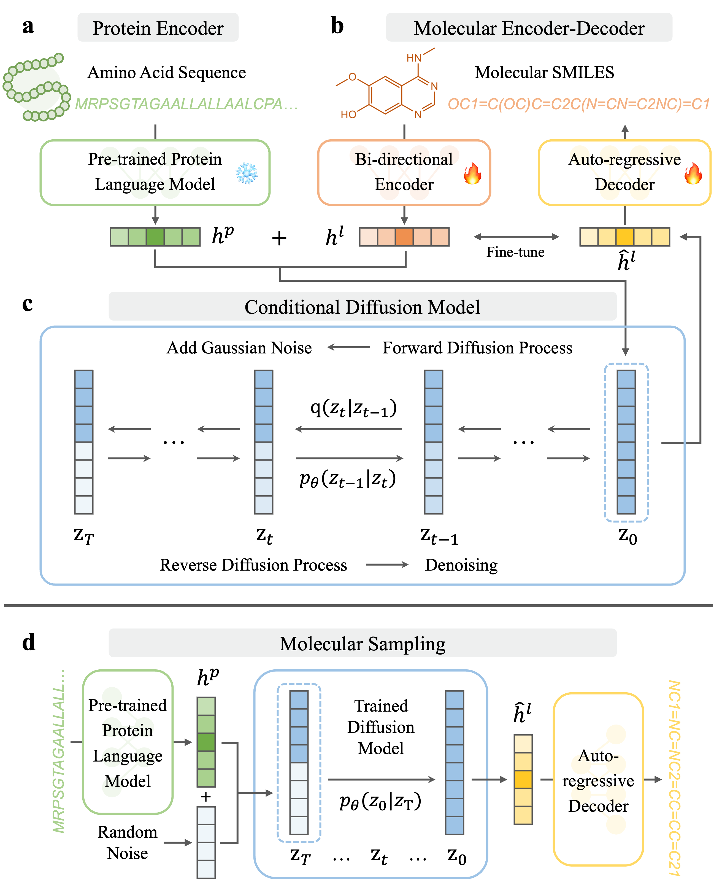

## Seq2Drug: sequence-based drug design with large language models and conditional diffusion models

Official implementation of Seq2Drug, a sequence-based molecule generation framework with large language models and conditional diffusion models.

## Seq2Drug
<div align="center">  

</div>

## Setup and dependencies
#### Dependencies:
```
- python 3.7
- pytorch 1.12.1
- autogluon 0.5.2
- dill 0.3.4
- fair_esm 2.0.0
- joblib 1.1.0
- numpy 1.21.2
- pandas 1.3.5
- rdkit 2022.9.5
- setuptools 59.8.0
- tqdm 4.62.2
```

#### Conda environment
```bash
# Run the commandline
conda create -n seq2drug python=3.7 -y
conda activate seq2drug
pip install -r requirements.txt
```
