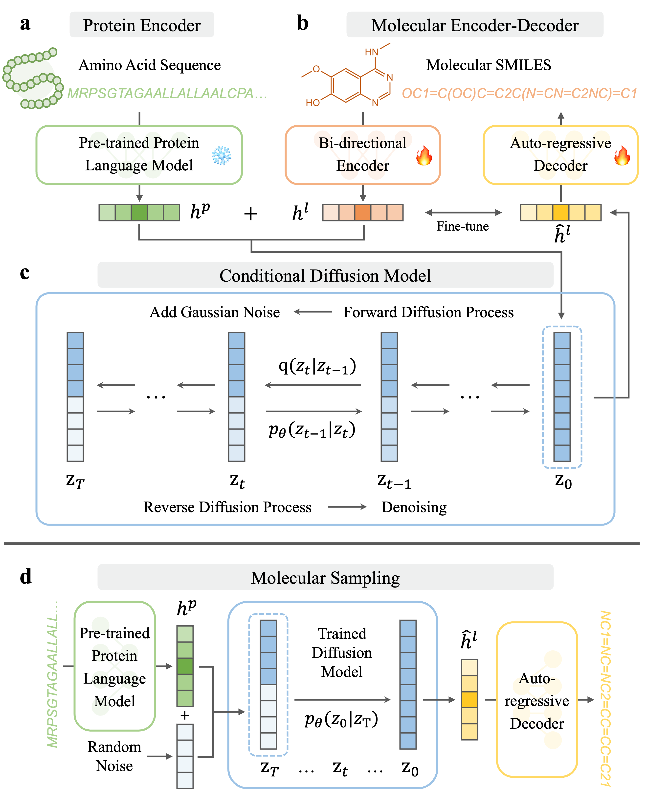

## Seq2Drug: sequence-based drug design with large language models and conditional diffusion models

Official implementation of Seq2Drug, a sequence-based molecule generation framework with large language models and conditional diffusion models.

## Seq2Drug
<div align="center">  

</div>

## Setup and dependencies
#### Dependencies:
```
- python 3.7.16
- torch 1.13.1
- pytorch-lightning 1.2.3
- transformers 4.22.2
- fair_esm 2.0.0
- rdkit 2023.3.2
- Babel 2.14.0
- biopython 1.81
- pysmiles 1.1.2
- wandb 0.18.7
- numpy 1.21.2
- pandas 1.3.5
- scikit-learn 1.0.2
- scipy 1.7.3
- tqdm 4.66.4
```

#### Conda environment
```bash
# Run the commandline
conda create -n seq2drug python=3.7 -y
conda activate seq2drug
pip install -r requirements.txt
```

## Training

Training on the crossdocked dataset, run:
```bash
bash run_train.sh
```

## Sampling

Sampling and evaluating on the crossdocked test set, using the trained model, run:
```bash
bash sample_evaluate_crossdocked.sh
```

Multi-target sampling and evaluation using trained model, run:
```bash
bash sample_evaluate_multitarget.sh
```
